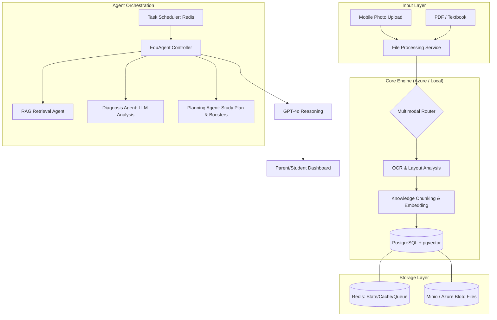

# EduLens-Next: AI-Powered Adaptive Learning Companion

> **每一个孩子的数字孪生导师** — An intelligent education ecosystem that tracks, analyses, and optimises a child's learning journey through daily photo uploads, AI-powered diagnostics, and personalised study planning.

---

## ✨ Key Features

| Feature | Description |
|---|---|
| 📸 **Multimodal Ingestion** | Upload homework/exam photos; AI performs OCR (Azure AI Vision or GPT-4o fallback) and extracts individual questions |
| 🧠 **Deep Error Attribution** | GPT-4o diagnoses *why* an answer is wrong — concept gap, calculation error, logic flaw, or knowledge blind spot |
| 🗺 **Knowledge Map** | Tracks each knowledge point (green/yellow/red) across subjects; powered by pgvector RAG retrieval |
| 📅 **Dynamic Study Planner** | AI generates a prioritised daily schedule based on weak points, homework load, and the child's energy level |
| 🎯 **Booster Questions** | Generates variant (same concept, different numbers/context) practice questions to verify real understanding |
| 📊 **Weekly Radar Reports** | Auto-generates weekly progress snapshots: comprehension, execution, stability, speed, resilience |
| 🔔 **Real-time Alerts** | Redis-backed session monitoring detects when a child is stuck and sends encouragement / rest reminders |
| 🌱 **Personality Mapping** | Long-term analysis builds a learning-personality profile (visual vs logical, patience, focus style) |

---

## 🏗 Architecture



---

## 🛠 Tech Stack

| Component | Technology |
|---|---|
| **LLM** | GPT-4o via Azure OpenAI Service |
| **OCR** | Azure AI Vision (Read API) · GPT-4o fallback |
| **Backend** | Python 3.11 · FastAPI · Uvicorn |
| **Database** | PostgreSQL 16 + pgvector extension |
| **Cache / Queue** | Redis 7 |
| **Object Storage** | Minio (dev, S3-compatible) · Azure Blob Storage (prod) |
| **Background Tasks** | Celery + Celery Beat |
| **Container** | Docker + Docker Compose |

---

## 📂 Repository Structure

```
Lumina-EduLens-Next/
├── src/
│   ├── main.py              # FastAPI application & REST endpoints
│   ├── celery_app.py        # Celery application & Beat schedules
│   ├── tasks.py             # Celery task definitions
│   ├── agents/
│   │   ├── edu_agent.py     # Core agent: upload, plan, booster generation
│   │   └── cron_agent.py    # Scheduled monitoring: speed alerts, weekly reports
│   ├── brain/
│   │   ├── llm_client.py    # Azure OpenAI wrapper (GPT-4o)
│   │   ├── prompts.py       # System prompts & message builders
│   │   └── rag.py           # pgvector RAG retrieval engine
│   ├── ingestion/
│   │   └── processor.py     # OCR pipeline + image segmentation
│   └── storage/
│       ├── db.py            # Async PostgreSQL helpers (asyncpg)
│       ├── redis_client.py  # Redis helpers (sessions, cache, alerts)
│       ├── schema.sql       # Full PostgreSQL schema with pgvector
│       └── storage_service.py  # Multi-cloud storage factory (Minio/Azure)
├── tests/
│   └── test_edulens.py      # Unit tests (no live services required)
├── docs/                    # PRD, architecture diagrams
├── docker-compose.yml       # One-command local dev stack
├── Dockerfile               # Production-ready container image
├── requirements.txt         # Python dependencies
└── .env.example             # Environment variable template
```

---

## 🚀 Quick Start (Local Development)

### Prerequisites
- Docker & Docker Compose
- An Azure OpenAI resource (GPT-4o deployment)

### 1. Clone & configure

```bash
git clone https://github.com/mxmore/Lumina-EduLens-Next.git
cd Lumina-EduLens-Next
cp .env.example .env
# Edit .env and fill in your AZURE_OPENAI_ENDPOINT and AZURE_OPENAI_KEY
```

### 2. Start the full stack

```bash
docker compose up -d
```

This starts:
- **PostgreSQL** (port 5432) with the pgvector extension
- **Redis** (port 6379)
- **Minio** (port 9000 API · 9001 console — `admin` / `password` by default)
- **FastAPI** (port 8000) — auto-applies the DB schema on first run
- **Celery worker** — processes background tasks
- **Celery Beat** — runs scheduled monitoring jobs

### 3. Explore the API

Open **http://localhost:8000/docs** for the interactive Swagger UI.

#### Example: Create a student

```bash
curl -X POST http://localhost:8000/students \
  -H 'Content-Type: application/json' \
  -d '{"name": "小明", "grade": "Grade 4"}'
```

#### Example: Upload a homework photo

```bash
curl -X POST http://localhost:8000/students/{student_id}/upload \
  -F "file=@math_homework.jpg" \
  -F "file_type=homework"
```

#### Example: Generate today's study plan

```bash
curl -X POST http://localhost:8000/students/{student_id}/plan \
  -H 'Content-Type: application/json' \
  -d '{"homework_list": ["数学练习册 P3-5", "英语单词抄写"], "energy_level": "high"}'
```

---

## 🧪 Running Tests

```bash
pip install -r requirements.txt
python -m pytest tests/ -v
```

Tests run without any live services — all external dependencies are mocked.

---

## 🔒 Data Privacy & Security

- **No secrets in code** — all credentials are loaded via environment variables (see `.env.example`).
- **Sensitive fields** in PostgreSQL (e.g., `personality_tags`) can be encrypted at the application layer before insertion.
- **Child data** should be stored in a private deployment; this repository provides no public-facing demo data.
- **Azure Blob SAS tokens** have configurable expiry (default: 1 hour) and are generated server-side.

---

## 📋 API Reference

| Method | Path | Description |
|---|---|---|
| `GET` | `/health` | Health check |
| `POST` | `/students` | Create a student profile |
| `GET` | `/students/{id}` | Get profile + knowledge map |
| `POST` | `/students/{id}/upload` | Upload homework/exam photo (triggers AI analysis) |
| `POST` | `/students/{id}/sessions` | Start a study session |
| `PUT` | `/students/{id}/sessions/{sid}` | End a study session |
| `GET` | `/students/{id}/errors` | List error items |
| `POST` | `/students/{id}/boosters` | Generate booster questions for an error |
| `POST` | `/students/{id}/plan` | Generate daily study plan |
| `GET` | `/students/{id}/plan` | Get plan for a specific date |
| `GET` | `/students/{id}/alerts` | Drain pending notifications |
| `GET` | `/students/{id}/reports` | List weekly assessment reports |

---

## 🗄 Database Schema Overview

| Table | Purpose |
|---|---|
| `student_profile` | Basic info + AI-inferred personality tags |
| `knowledge_node` | Curriculum knowledge graph (subjects → topics → prerequisites) |
| `student_knowledge_map` | Per-student mastery score (green/yellow/red) for each knowledge node |
| `study_material` | Uploaded file metadata + OCR text + 1536-dim embedding |
| `study_session` | Session timing, accuracy rate, AI evaluation |
| `error_item` | Individual wrong answers with deep attribution + embeddings |
| `practice_item` | AI-generated booster (variant) questions |
| `daily_study_plan` | AI-generated daily schedules |
| `weekly_report` | Weekly radar-chart data + recommendations |

---

## 🗺 Roadmap

- [ ] Mobile frontend (React Native) with offline-first photo capture
- [ ] Resumable chunked upload (TUS protocol)
- [ ] Web search agent integration (Bing Search API) for current-events questions
- [ ] Classroom / school-admin dashboard (B2B)
- [ ] Exportable PDF progress reports
- [ ] Multi-language support (English, Chinese)
